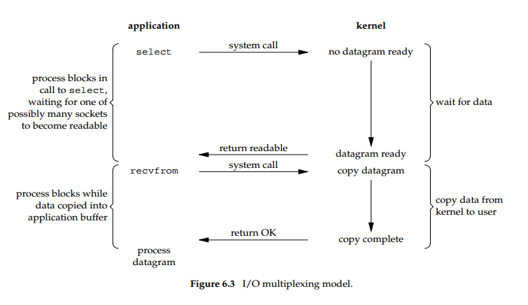
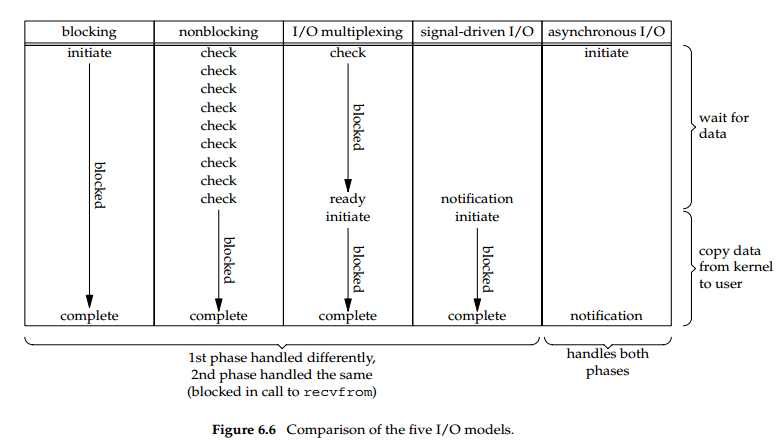

# 6.1 introduction
-- 0. TCP 客户端同时处理两个输入时:一个标准输入和一个TCP socket, 会有一个问题, 当客户端在调用fgets时被阻塞 server进程被kill掉. 服务端TCP正确的发送了一个FIN到客户端, 但是客户端进程此时读标准输入被阻塞, 将不会收到EOF.
1. IO多路复用: 需要kernel提供这样一种能力, 当一个或多个I/O条件准备好后通知用户app. 
2. 使用场景:
    - 当客户端处理多个描述符时(通常是中断输入和一个网络socket)
    - 客户端同时处理多个sokets时
    - TCP server同时处理监听和连接中的sockets
    - server同时处理TCP和UDP请求
    - server同时处理多个服务或者多个协议
    > IO多路复用不止局限于网络编程, 一些复杂应用也需要用到这种技术
# 6.2 I/O models
一个input操作通常分为两个阶段:
1. 等待数据准备好
2. 从内核复制数据到进程

对于一个socket上的输入操作, 第一步通常包含等待网络上的数据抵达. 当包到达后, 它先被copy到内核缓冲区. 第二步开始, 从内核缓冲区copy到app缓冲区

## 阻塞I/O模型
最普遍的I/O模型是阻塞模型, 所有sockets是默认阻塞的.  
我们使用UDP数据报来解释这一模型, 用UDP的原因是, "准备好读的数据"这一概念很简单, 要么完整数据报接收到, 要么没有. 如果在TCP条件下就复杂一些, 因为额外的变量例如socket的low-water mark发挥作用.  

## 非阻塞I/O模型
当我们将socket设置成非阻塞的, 意思是告诉kernel"当IO操作请求不使进程进入休眠状态而无法完成时, 不要将进程置为休眠状态, 但是要返回错误"  
  
当一个应用循环调用recvfrom时, 这种方式叫做轮询, 应用持续轮询kernel来判断操作是否就绪, 这会很耗费CPU时间片

## I/O多路复用
使用IO多路复用, 是在`select`或者`poll`这二者中的一个系统调用中阻塞, 而不是阻塞实际的IO系统调用  
  
我们在调用`select`中阻塞, 等待数据报socket可读. 当`select`返回告知socket可读, 然后调用`recvfrom`来copy数据报到应用缓存. 对比阻塞式IO没有显示出什么优势, 并且还多了一次系统调用. 但是优点是使用`select`可以等待多个描述符就绪.
>另一个接近的方案是使用多线程阻塞IO

## 信号驱动的I/O(SIGIO)
我们也可以使用信号, 告诉内核当描述符就绪时使用SIGIO信号通知我们.  
  
先开启socket的信号驱动I/O并调用sigaction系统函数安装信号处理方法. 该方法会立刻返回并且进程会继续等待, 因为他被阻塞了. 当数据报就绪可以读后, SIGIO信号产生. 这时既可以通过信号处理方法读取数据报然后通知主程序准备处理, 也可以直接通知主程序读取数据报  
物理我们如何处理信号, 该模型优势是在等待数据报到达期间我们没有被阻塞, 主程序可以继续执行.

## 异步I/O(posix aio_函数)
异步IO由POSIX标准定义, 不同标准有不同的实时函数. 一般来讲, 这些函数会告诉内核开始操作并且当整个操作完成后通知我们(包含从内核copy回应用). 和信号驱动IO主要的区别在于 信号驱动告诉我们什么时候可以开始IO操作, 而异步IO告诉我们什么时候IO操作完成.  
  
调用aio_read并传递kernel 描述符, 缓冲区指针, 缓冲区size, 文件offset, 通知方式. 该系统调用会立刻返回并且我们的进程在等待IO完成时不会被阻塞.

  
同步IO和异步IO区别在于请求进程在IO操作完成前是否阻塞, 前四种io模型都是同步io, 只有最后一种是异步IO  

# 6.3 select function
